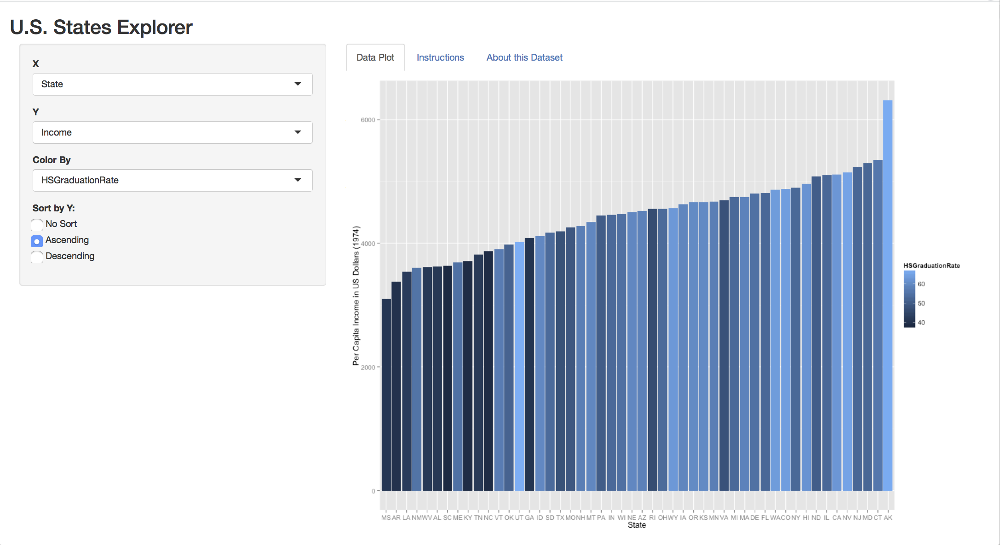

## The States Explorer Application
* <b>Motivation</b>
    * Explore and Demonstrate Dynamic UI Interfaces in a Shiny Application
    * Use a simple data set that can be plotted in different ways
    * Use the <b>Reactive</b> properties of renderPlot() to respond to changed settings in the UI widgets
    * Dynamically hide or expose UI widgets based on selections in other UI widgets 
        to eliminate irrelevant widgets from the UI
* <b>Implementation</b>
    * The state data set from the datasets library
    * The conditionalPanel() UI widget used to expose/hide UI input widgets based on selections in other UI widgets
    * The tabsetPanel() UI widget used to provide a multi-tabbed display to include 
        plots, instructions and information about the data set in the UI

---
    
## The States Explorer UI

```{r ,echo=FALSE}
library(datasets)
library(plyr)
#Initialize a list of data item names from the data sets for the UI elements to use.
#Names for the states data set
dsNames <- c("State", "Region", "Population", "Income", "Illiteracy",
                "LifeExpectancy", "MurderRate", "HSGraduationRate",
                "DaysFrost", "Area")
```

* The data elements used from the "state"" dataset are:
    * `r dsNames`
    * Data elements are used to populate selectInput() widgets

<center></center>

--- 

## The States Explorer - Sorting Data

* Sorting state codes on the X-axis by the Y-axis selection values requires some extra processing
    * The dataset is sorted by the selected Y-axis data values
    * The state column is then refactored with the new order to allow it to print
        in the correct order as shown in the R code fragment below
``` {r, echo=TRUE, eval=FALSE}
if (input$dataSort == 'asc') {
 #For an ascending sort, first sort the data by the selected Y-axis data item
 pdataset <- dataset[order(dataset[match(input$y,names(dataset))]),]
 #Then re-factor the state list that is the X-axis so the plot sorts correctly
 pdataset$State <- factor(pdataset$State, levels = pdataset$State)
} else if (input$dataSort == 'desc') {
 #For an descending sort, first sort the data by the selected Y-axis data item
 pdataset <- dataset[order(-dataset[match(input$y,names(dataset))]),]
 #Then re-factor the state list that is the X-axis so the plot sorts correctly
 pdataset$State <- factor(pdataset$State, levels = pdataset$State)
            } 
```

---

## The States Explorer UI - Dynamic Widgets

* Widgets exposed in the Shiny app are dynamically hidden or exposed based on the 
    selected value of the X-axis selector
    * Selecting <b>Region</b> as the X-axis hides the <b>Color By</b> selector and 
        <b>Sort</b> radio buttons
    * With only four regions, sorting is not necessary to do region by region comaprisons 
        as it is when there are 50 states to compare

<center></center>


